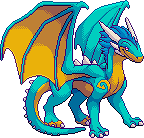

# PixPet - Web3像素宠物NFT游戏

<div align="center">
  
  <p>创建、培养和战斗你专属的像素宠物</p>
</div>

[](https://github.com/h7ml/pixpet-frontend/actions/workflows/ci-cd.yml)
[](https://opensource.org/licenses/MIT)

## 项目介绍

PixPet是一款基于Web3技术的NFT像素宠物游戏，构建在Monad区块链上。玩家可以铸造独特的像素风格宠物，培养它们的属性和技能，参与战斗并在市场上进行交易。

### 核心功能

- 🎨 **AI生成宠物**：使用先进的AI技术生成独特像素风格的宠物
- 🔄 **链上养成**：在区块链上培养和提升宠物的各项属性与技能
- ⚔️ **PvP战斗系统**：参与基于回合制的宠物对战
- 🏪 **宠物市场**：买卖、拍卖和交易你的宠物
- 👨‍👩‍👧‍👦 **社区互动**：参与社区活动和治理投票

## 技术栈

- **前端框架**：React.js + TailwindCSS
- **Web3连接**：RainbowKit + Wagmi + Viem
- **区块链**：主要在Monad链上部署，提供高性能和低费用
- **合约开发**：Solidity (合约代码位于单独的仓库)
- **包管理工具**：pnpm

## 快速开始

### 前提条件

- Node.js v16+
- pnpm（`npm install -g pnpm`）
- 现代浏览器（Chrome、Firefox、Safari等）
- MetaMask或其他支持的Web3钱包

### 安装与启动

1. 克隆仓库

```bash
git clone https://github.com/h7ml/pixpet-frontend.git
cd pixpet-frontend
```

2. 安装依赖

```bash
pnpm install
```

3. 启动开发服务器

```bash
pnpm start
```

4. 打开浏览器访问 [http://localhost:3000](http://localhost:3000)

### 构建生产版本

```bash
pnpm build
```

## 项目结构

```
pixpet-frontend/
├── public/            # 静态资源
├── src/
│   ├── components/    # UI组件
│   ├── contracts/     # 合约ABI和接口
│   ├── hooks/         # 自定义React Hooks
│   ├── pages/         # 页面组件
│   ├── App.jsx        # 主应用组件
│   └── index.jsx      # 应用入口
├── .github/           # GitHub Actions配置
└── package.json       # 项目元数据
```

## 连接钱包

PixPet支持多种Web3钱包连接，包括：

- MetaMask
- Coinbase Wallet
- WalletConnect
- Rainbow Wallet
- Argent

## 部署

项目当前部署在:

- Monad主网: [https://pixpet.h7ml.cn](https://pixpet.h7ml.cn)
- Monad测试网: [https://testnet.pixpet.h7ml.cn](https://testnet.pixpet.h7ml.cn)

## 贡献指南

欢迎贡献！请查看[贡献指南](CONTRIBUTING.md)了解如何参与项目开发。

## 路线图

- [ ] 宠物育种系统
- [ ] 公会系统和团队战斗
- [ ] 跨链资产桥接
- [ ] 移动应用版本
- [ ] 高级AI生成模型

## 许可证

本项目基于MIT许可证 - 详情请查看[LICENSE](LICENSE)文件。

## 联系方式

- 网站: [https://pixpet.h7ml.cn](https://pixpet.h7ml.cn)
- Twitter: [@PixPetNFT](https://twitter.com)
- Discord: [PixPet社区](https://discord.gg)
- 邮箱: <hello@pixpet.h7ml.cn>
